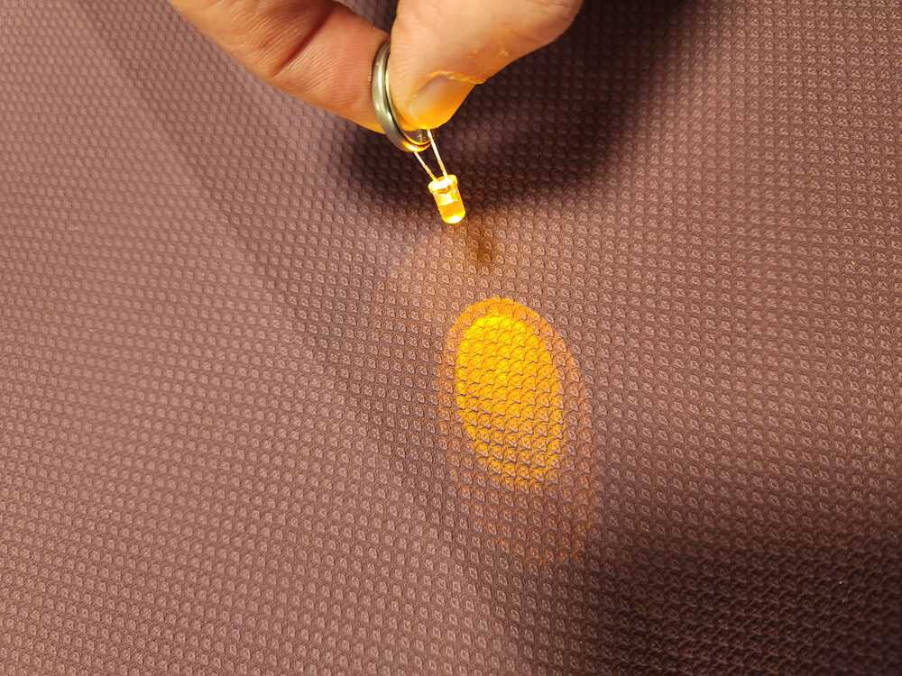
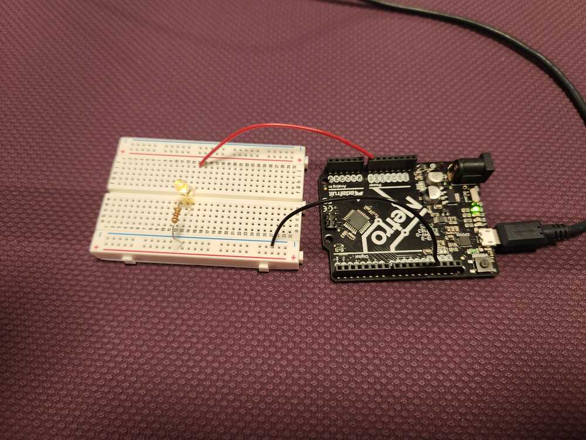
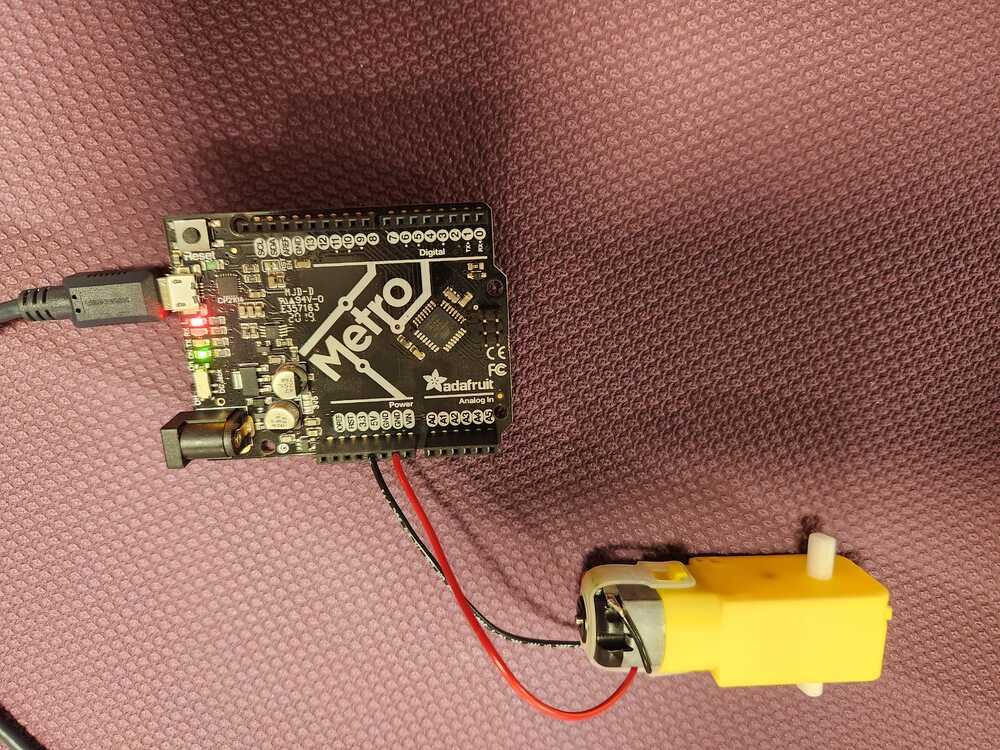
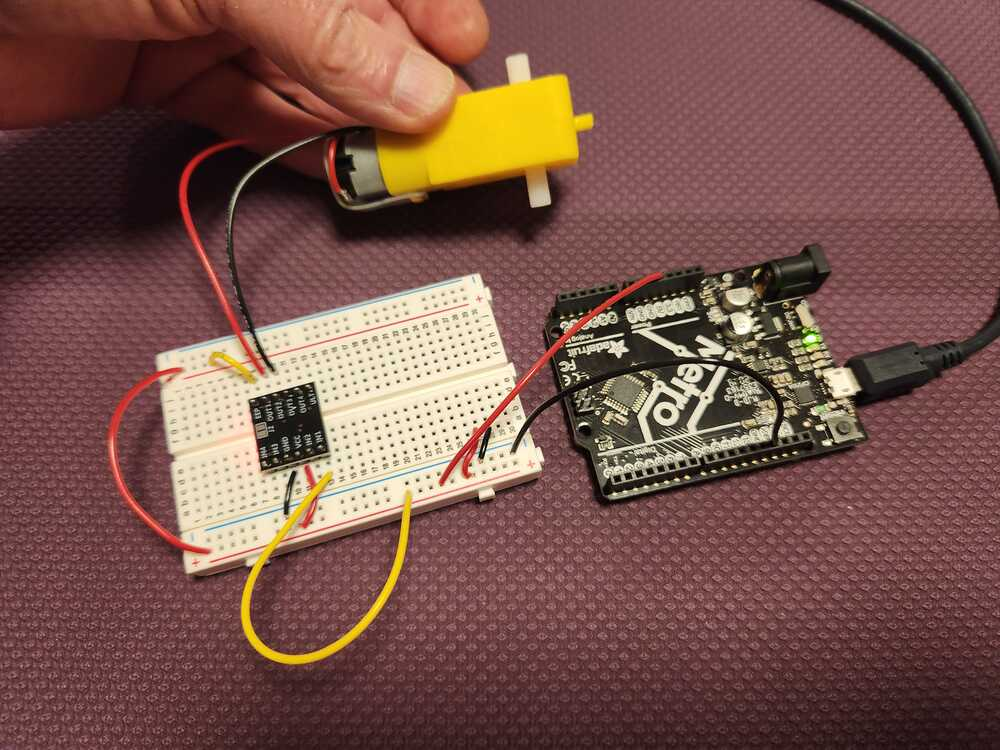
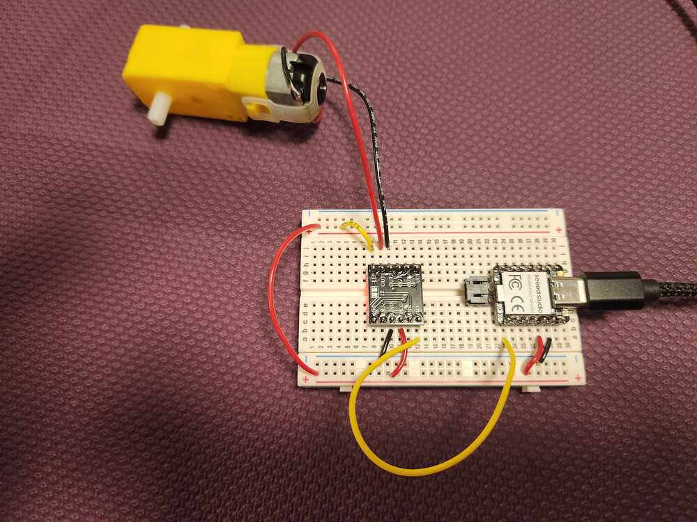
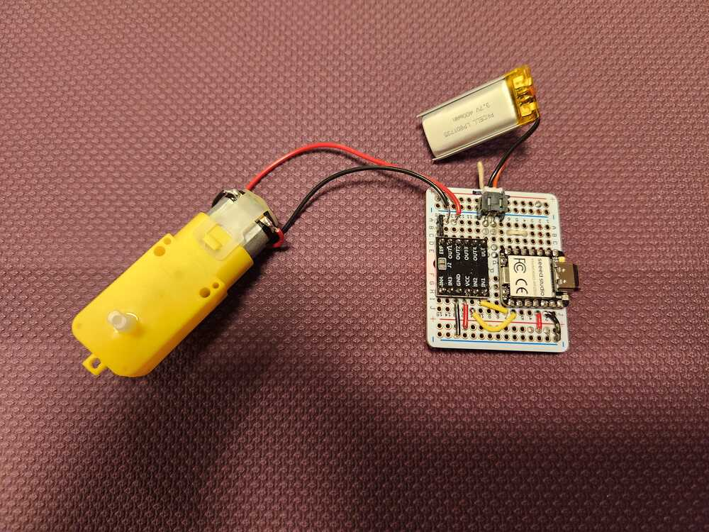
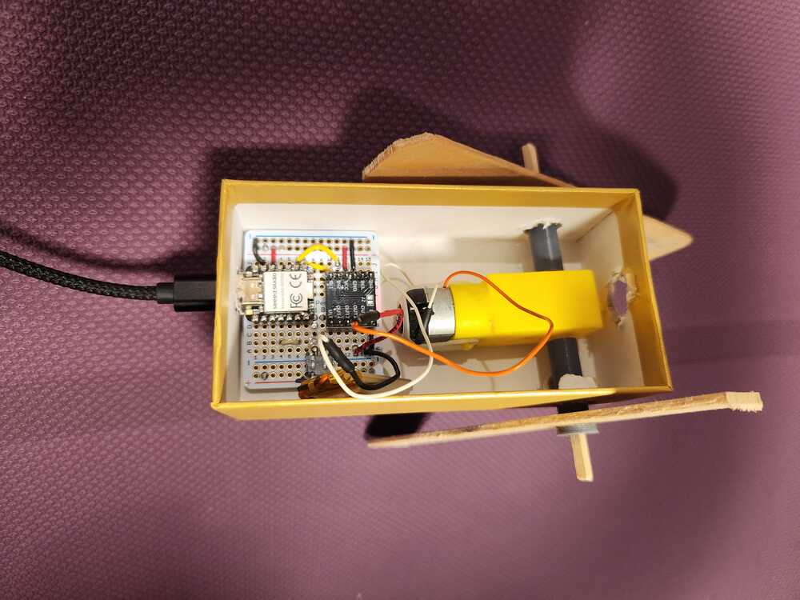

intro to elect readme

<figure>

</figure>

<figure>

</figure>

<figure>

</figure>

<figure>

</figure>

<figure>

</figure>

<figure>

</figure>

<figure>

</figure>

[link to video of "soap box derby"](https://youtu.be/t1SzbhwTUY0)

