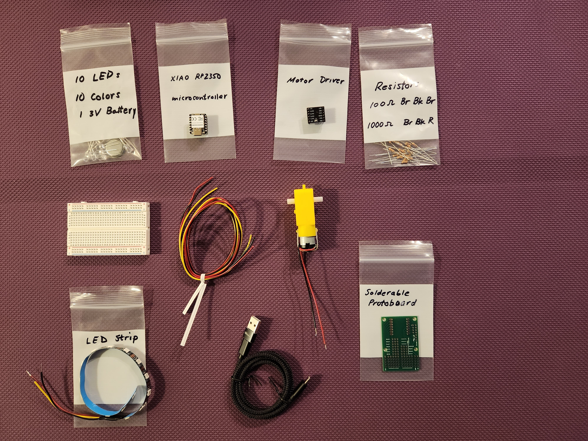
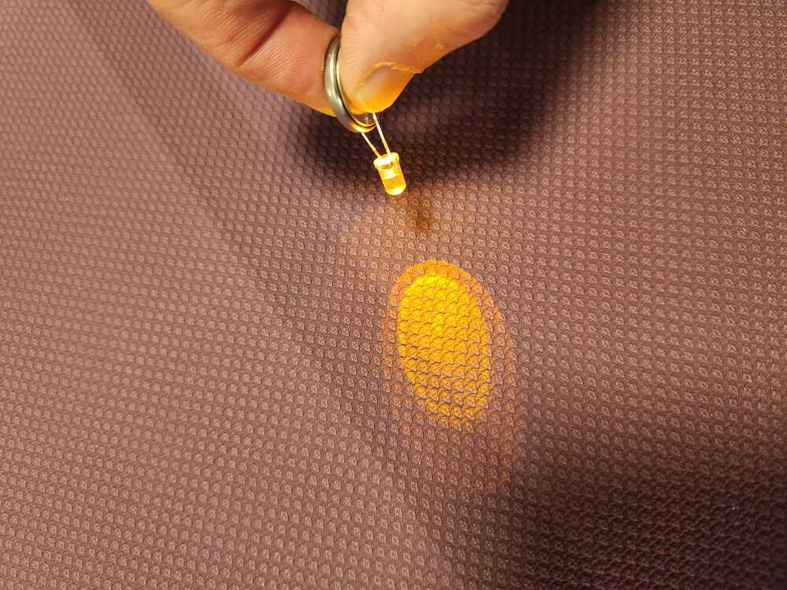
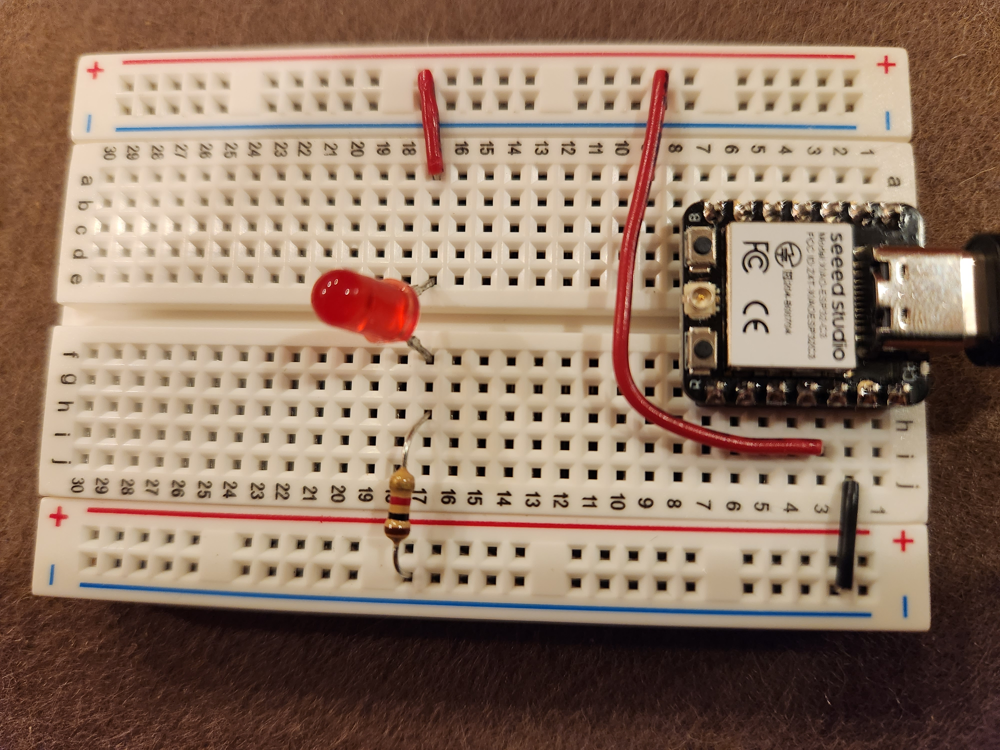
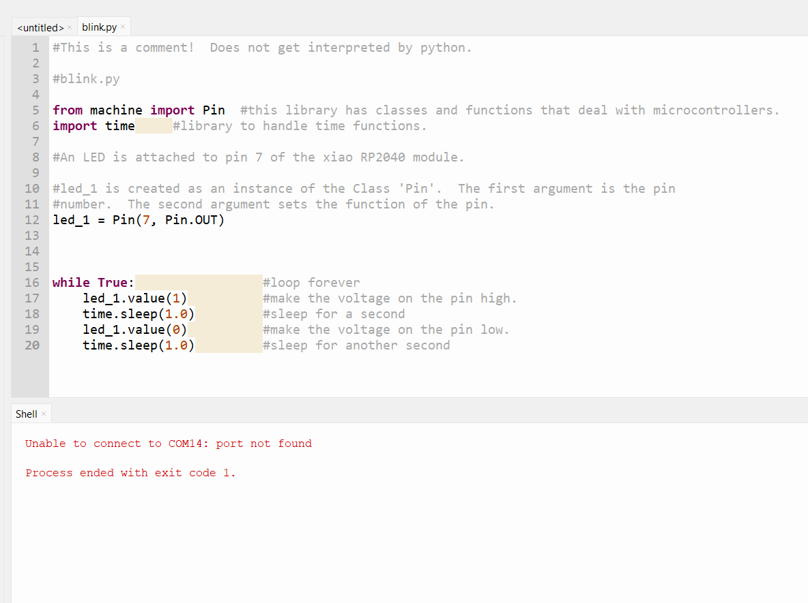
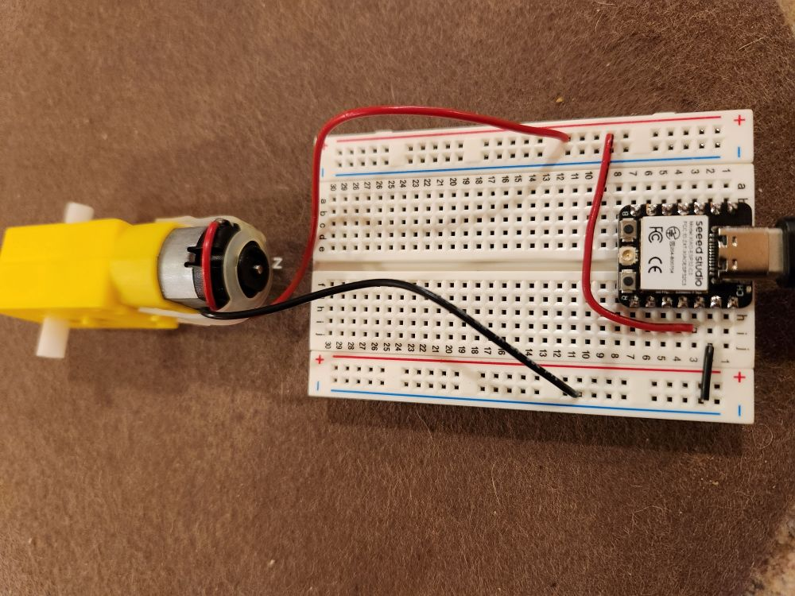
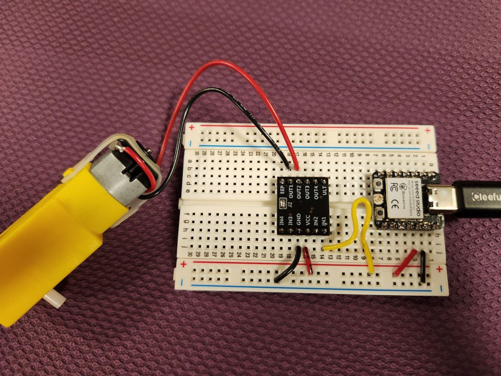
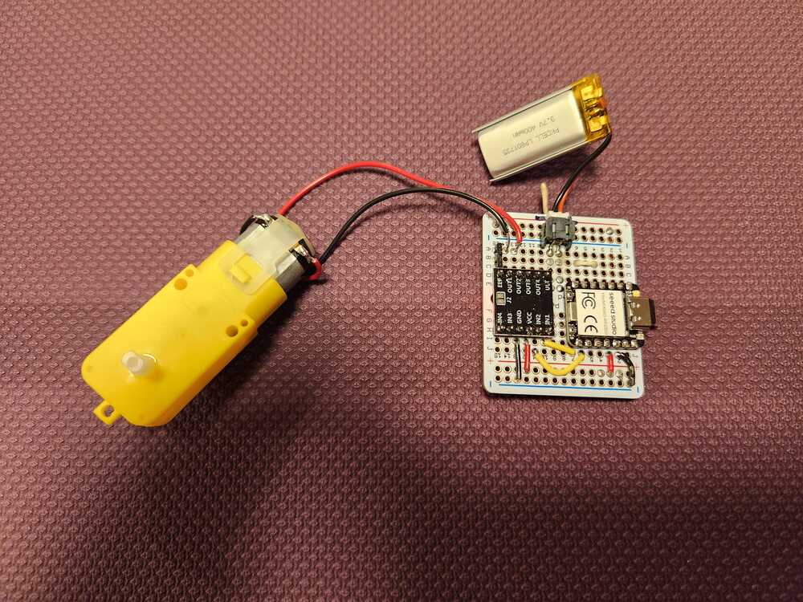
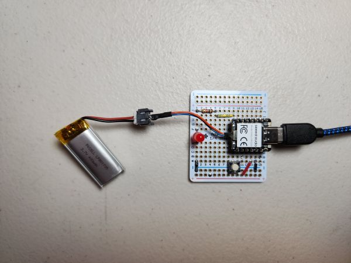
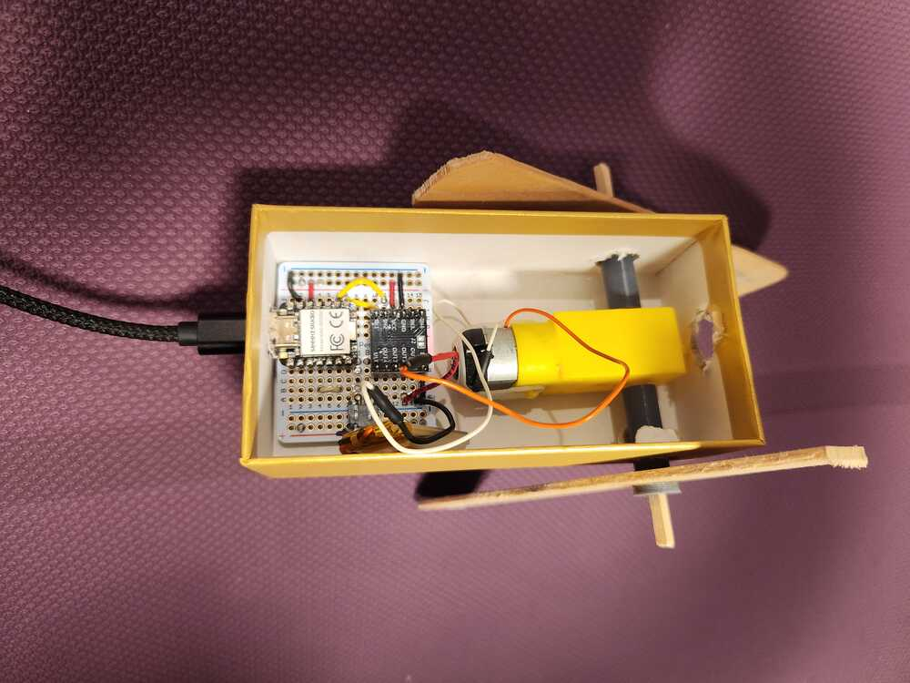

Kit for spring 2026 workshops

<figure>

</figure>

Suggestion for sequence in electronics intro:

First have them make circuits with battery and LED's.  Discuss and experiment with colors, number of led's, direction, and other.  Discuss and draw circuit diagram.  
<figure>

</figure>

Then use microcontroller modules on push-in circuitboards to make circuits.  Continue discussion.  Use multimeter to learn about voltage in a circuit.  The power and ground pins of the microcontroller are the "battery".  We will prepare the microcontrollers:  install Micropython, and pre-load with a program that makes a pin 'blink',  and show that the pin can be used as a source of voltage to make an LED turn off and on.  No programming needed yet, but they can measure voltages and get an idea of what we mean by programming. 

<figure>

</figure>

Programming.

Connect the microcontroller to Thonny (or alternatively, Arduino Lab for MP), where you can see the program files. Learn how to edit and run programs.  Learn about REPL command line.  Learn to save programs as "main.py" to run on reset.  Add a second pin and second LED.  

 
<figure>

</figure>

Work with a program that controls RGB LED strips.  

Run a motor on a breadboard using the power and ground pins of a microcontroller.  Find out how to make motor run forwards and backwards.  Discover that the board pins that are able to make the LED blink cannot drive motor directly.  

<figure>

</figure>

To get motor to "blink", we need a motor driver. Use a motor driver on the circuitboard.  See how to make motor run forward and backwards using this driver.  Use built-in blink to make motor start and stop.  Maybe make motor go both ways using a second "blink" pin.

<figure>

</figure>

If we want to make a project (robot, kinetic sculpture, vehicle...) we need a way to make it smaller and more secure, and need a battery!  
We can solder everything onto a little proto-board, and include a battery that can be charged using the XIAO's built-in charger.  This will involve stripping wires, soldering, and manipulating little parts.  

<figure>

</figure>

<figure>

</figure>

Now that they have a board with a battery, they can make projects that incorporate motors or LED's that can be charged using a USB charger, and can run independently.  Below is a little cart that I made using a box that contained a bar of soap.  My "soap box" racer.

<figure>

</figure>

[link to spreadsheet with items and prices](https://docs.google.com/spreadsheets/d/1ea21Ol0HnfFcnW5KguXi43tg_k-Ri7uJ2SghusxsvjQ/edit?usp=sharing)

[link to video of "soap box derby"](https://youtu.be/t1SzbhwTUY0)

